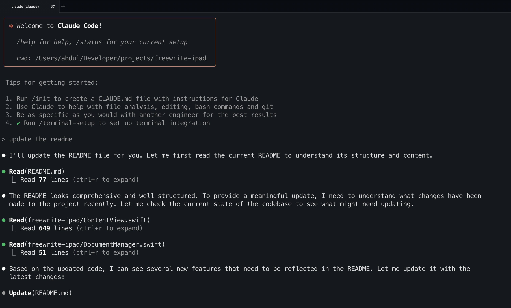
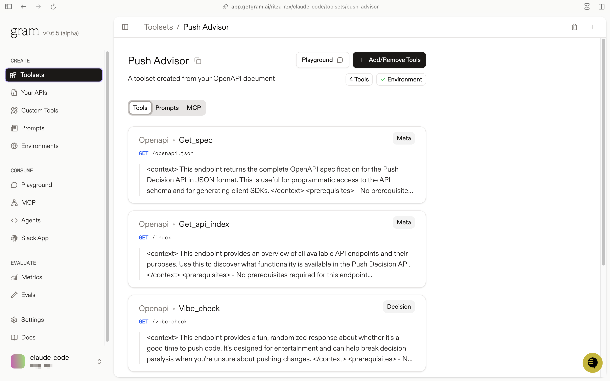
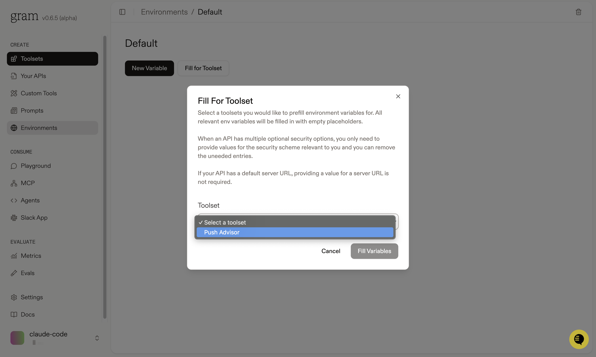
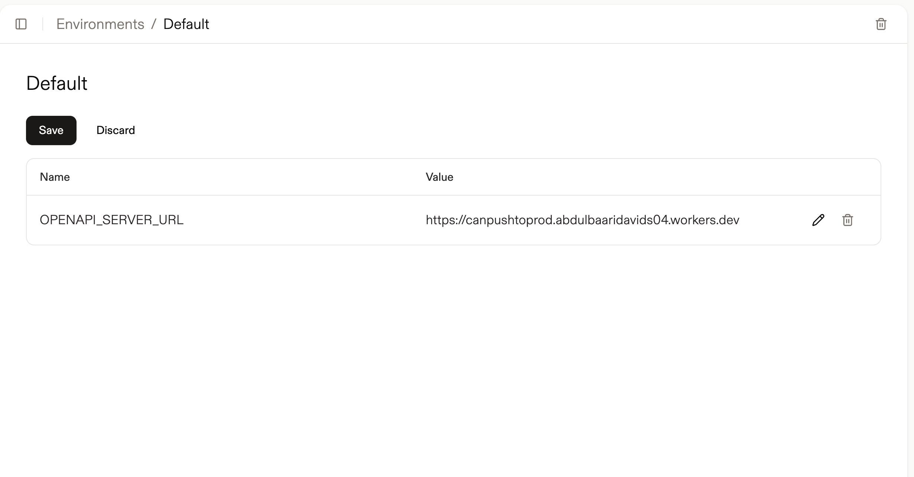
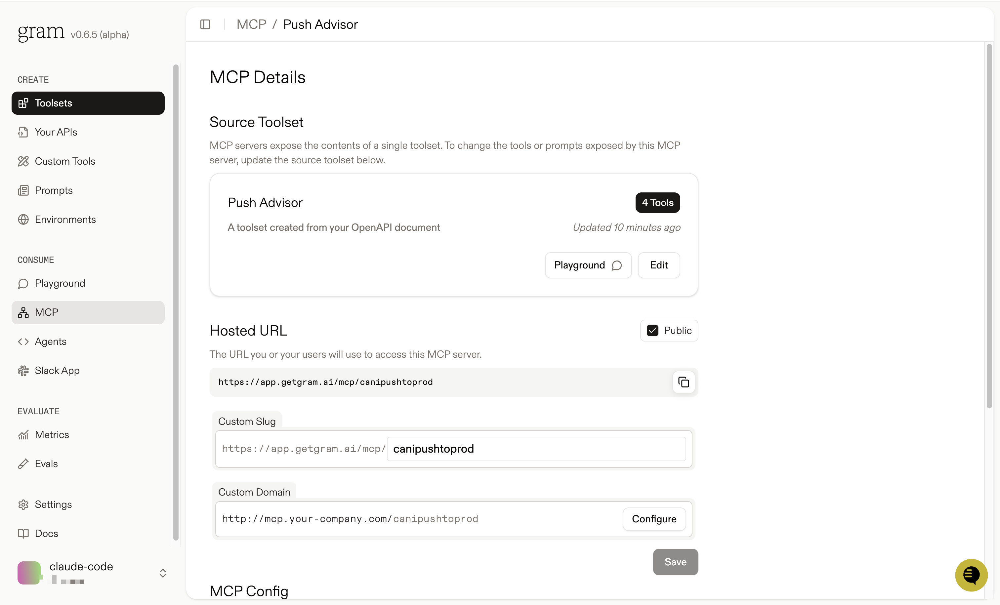
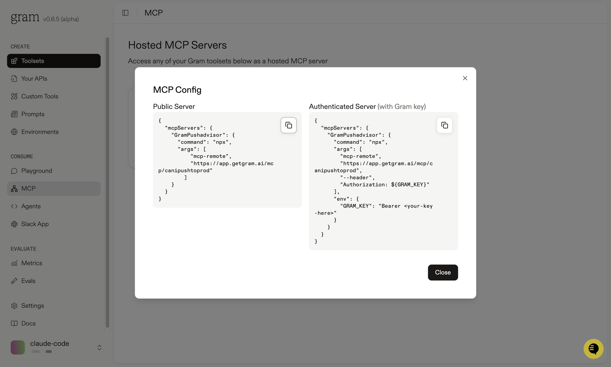
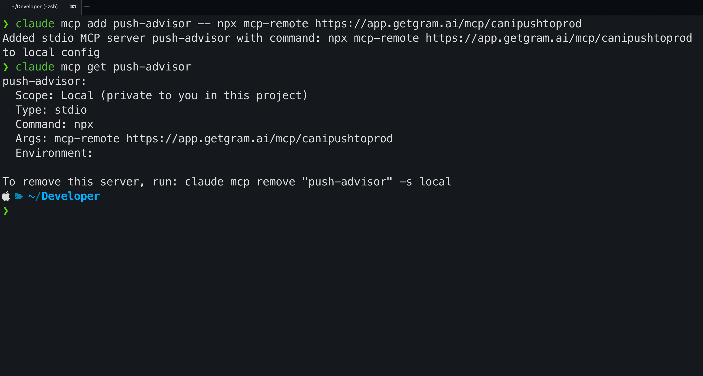
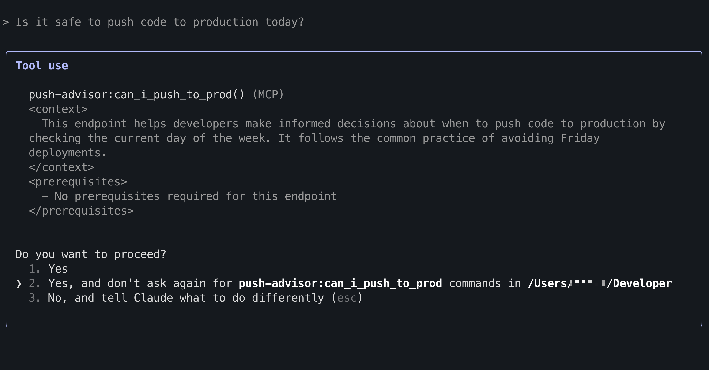
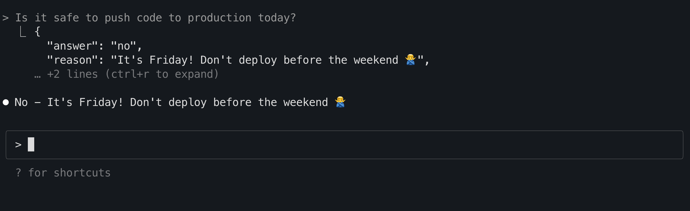

[Claude Code](https://docs.anthropic.com/en/docs/claude-code) is Anthropic's terminal-based CLI that brings Claude's capabilities directly to your command line. Unlike Claude Desktop, which runs in a graphical interface, Claude Code operates entirely in your terminal and has access to your current project folder. 



When combined with [MCP (Model Context Protocol)](https://modelcontextprotocol.io/) servers, Claude Code becomes even more powerful. You can connect it to APIs, databases, and services using MCP, granting Claude access to your tools and infrastructure.

In this guide, we'll show you how to connect Claude Code to a [Gram-hosted MCP server](./the-easiest-way-to-host-mcp-servers) using our Push Advisor example from the [Gram concepts guide](./gram-concepts). You'll learn how to set up the connection, test it, and use natural language to perform vibe checks before you vibe code.

## What you'll build

We'll connect Claude Code to a Gram-hosted MCP server built around the **Push Advisor API**, a simple "vibe check" service that tells you whether it's safe to push code to production.

By the end, you'll be able to ask Claude Code if the vibes are good to push code to production right from your terminal, with Claude Code automatically calling the appropriate API endpoints through your MCP server.

You can find the full code for the example API as well as the OpenAPI document in the [example repository](https://github.com/ritza-co/gram-examples/tree/main/push-advisor-api).

## Prerequisites

Before we start, you'll need **Claude Code CLI** ([install from Anthropic](https://docs.anthropic.com/en/docs/claude-code) if you haven't already) and **a Gram account** (sign up at [getgram.ai](https://getgram.ai)).

Let's verify Claude Code is installed correctly:

```bash
claude --help
```

You should see Claude's available commands and options. You'll need to [authenticate with Claude Code to use it](https://docs.anthropic.com/en/docs/claude-code/setup).

## Creating a Gram MCP server

If you already have a Gram MCP server configured, you can skip to [Step 2](#connect-claude-code-to-your-gram-server). Otherwise, let's quickly set up the Push Advisor example.

For an in-depth guide on how Gram works and a more detailed guide on how to create a Gram MCP server, check out our [Gram concepts guide](./gram-concepts).

### Creating tools

The Push Advisor API is a simple deployment decision service that tells you whether "the vibes are good" to push code based on the day of the week. It's hosted at `canpushtoprod.abdulbaaridavids04.workers.dev` and includes endpoints like `/vibe-check` for deployment vibes.

1. Log in to your [Gram dashboard](https://getgram.ai)
2. Go to the **Home** tab and click **New OpenAPI Source**
3. Upload the [Push Advisor OpenAPI document](https://github.com/ritza-co/gram-examples/blob/main/push-advisor-api/openapi.yaml)
4. Give it a name and an MCP server slug for the MCP server you'll create later

Your Push Advisor Toolset will be created automatically. You can find it in the **Toolsets** tab.



### Configuring environment variables

[Environments](../concepts/environments) store API keys and configuration separate from your toolset logic. 

Go to the **Environments** tab and click the "Default" environment. Click **Fill for toolset** and select your "Push Advisor" toolset to automatically populate the required variables. 



Set the `OPENAPI_SERVER_URL` to `https://canpushtoprod.abdulbaaridavids04.workers.dev` and click **Save**.



### Publishing your MCP server

Finally, let's make your toolset available as an MCP server. 

Go to the **MCP** tab, find your "Push Advisor" toolset, and click **Edit**. On the MCP Details page, tick the **Public** checkbox and click **Save**.



Scroll down to the **MCP Config** section and copy the Public Server configuration.



:::tip[Tip]
Alternatively, you can use the Authenticated Server configuration. This is useful if you want to use the MCP server in a private environment. You'll need to generate an API key in the **Settings** tab and use it in the MCP Config.
:::

## Connect Claude Code to your Gram server

Now we'll connect Claude Code to your newly created MCP server.

### Get your MCP configuration

In your Gram dashboard, go to the **MCP** tab, find your "push-advisor" server, and click **MCP Config** to copy the configuration.

The configuration will look something like this:

```json
{
  "mcpServers": {
    "GramPushadvisor": {
      "command": "npx",
      "args": [
          "mcp-remote",
          "https://app.getgram.ai/mcp/canipushtoprod"
        ]
    }
  }
}
```

Or if you're using the Authenticated Server configuration:

```json
{
  "mcpServers": {
    "GramPushadvisor": {
      "command": "npx",
      "args": [
        "mcp-remote",
        "https://app.getgram.ai/mcp/canipushtoprod",
        "--header",
        "Authorization: ${GRAM_KEY}"
      ],
      "env": {
        "GRAM_KEY": "Bearer <your-key-here>"
      }
    }
  }
}
```

### Add the server to Claude Code

Claude Code uses a different approach than Claude Desktop for MCP server configuration. Instead of a JSON config file, you add servers using the `claude mcp add` command.

For the **Public Server** configuration, run this command in your terminal (replace with your actual MCP server URL):

```bash
claude mcp add push-advisor -- npx mcp-remote https://app.getgram.ai/mcp/canipushtoprod
```

For the **Authenticated Server** configuration:

```bash
claude mcp add push-advisor \
  -e GRAM_KEY="Bearer your-api-key-here" \
  -- npx mcp-remote https://app.getgram.ai/mcp/canipushtoprod --header "Authorization: ${GRAM_KEY}"
```

:::tip[Understanding the command]
- `push-advisor` is the name you're giving the server locally
- `--` separates Claude Code flags from the server command
- `npx mcp-remote` is the package that handles remote MCP server connections
- For authenticated servers, `-e GRAM_KEY=...` sets your API key as an environment variable
- The `--header` flag passes the authorization header to the remote server
:::

### Verify the connection

Check that your server was added successfully:

```bash
claude mcp list
```

You should see `push-advisor` in the list. To see the full configuration:

```bash
claude mcp get push-advisor
```



## Test your setup

Now let's test the connection by starting Claude Code and running a vibe check.


```bash
claude
```

This starts an interactive session with Claude Code in your terminal.

Ask Claude a basic question like `whats the vibe today?`

<video width="600" controls>
  <source src="./assets/claude-code-showcase.mp4" type="video/mp4" />
    Your browser does not support the video tag.
</video>

### Tool permissions

Ask Claude to check if it's safe to push code to production today.

```
> Is it safe to push code to production today?
```



Claude Code will use the `can_i_push_to_prod` tool to check the current day and ask for permission to use it. You'll see a prompt asking you to confirm the tool call.




## Troubleshooting

### Server not found

If Claude Code can't find your server:

```bash
# Check if the server is listed
claude mcp list

# Remove and re-add the server
claude mcp remove push-advisor
claude mcp add push-advisor -- npx mcp-remote https://app.getgram.ai/mcp/canipushtoprod
```

### Authentication errors

If you get authentication errors, verify your Gram API key in the dashboard under **Settings > API Keys**, check that your environment variables are set correctly in Gram, and ensure the Push Advisor API base URL is accessible.

### Tool calls not working

If Claude Code isn't calling your tools, test the MCP server in the **Gram Playground** first, check that your toolset includes the tools you're trying to use, and verify the environment is correctly configured with required variables.

## What's next

You now have Claude Code connected to a Gram-hosted MCP server with vibe checking capabilities. 

Ready to build your own MCP server? [Try Gram today](https://getgram.ai) and see how easy it is to turn any API into agent-ready tools. 