[Gemini CLI](https://github.com/google-gemini/gemini-cli) is Google's open-source terminal-based AI agent that brings Gemini's capabilities directly to your command line. Unlike web-based interfaces, Gemini CLI operates entirely in your terminal and has access to your current project folder, offering a lightweight and efficient way to interact with Gemini models from within your project.

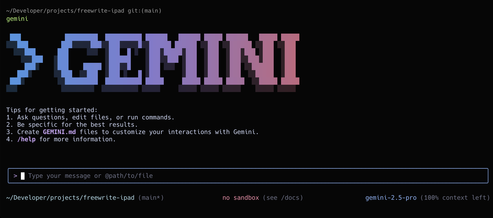

When combined with [MCP (Model Context Protocol)](https://modelcontextprotocol.io/) servers, Gemini CLI becomes even more powerful. You can connect it to APIs, databases, and services using MCP, granting Gemini access to your tools and infrastructure through built-in MCP support.

In this guide, we'll show you how to connect Gemini CLI to a [Gram-hosted MCP server](./the-easiest-way-to-host-mcp-servers) using our Push Advisor example from the [Gram concepts guide](./gram-concepts). You'll learn how to set up the connection, test it, and use natural language to perform vibe checks before you vibe code.

## What you'll build

We'll connect Gemini CLI to a Gram-hosted MCP server built around the **Push Advisor API**, a simple "vibe check" service that tells you whether it's safe to push code to production.

This setup enables asking Gemini CLI if the vibes are good to push code to production right from the terminal, with Gemini CLI automatically calling the appropriate API endpoints through the MCP server.

You can find the full code for the example API as well as the OpenAPI document in the [example repository](https://github.com/ritza-co/gram-examples/tree/main/push-advisor-api).

## Prerequisites

Before starting, install **Gemini CLI** and create **a Gram account** (sign up at [getgram.ai](https://getgram.ai)). Ensure you have Node.js version 18 or higher installed. 

### Installing Gemini CLI

You have two options to install Gemini CLI:

**Option 1: Run directly with npx:**
```bash
npx https://github.com/google-gemini/gemini-cli
```

**Option 2: Install globally:**
```bash
npm install -g @google/gemini-cli
```

### Verify installation

Test that Gemini CLI is working:

```bash
gemini --help
```

You should see Gemini's available commands and options.

### Authentication

When you first run `gemini`, you'll be prompted to authenticate. You can sign in with your personal Google account to get free access to Gemini 2.5 Pro with generous usage limits (60 requests per minute, 1,000 requests per day).

## Creating a Gram MCP server

If you already have a Gram MCP server configured, you can skip to [connecting Gemini CLI to your server](#connect-gemini-cli-to-your-gram-server). Otherwise, let's quickly set up the Push Advisor example.

For an in-depth guide on how Gram works and a more detailed guide on how to create a Gram MCP server, check out the [Gram concepts guide](./gram-concepts).

### Creating a toolset

The Push Advisor API is a simple deployment decision service that tells you whether "the vibes are good" to push code based on the day of the week. It's hosted at `canpushtoprod.abdulbaaridavids04.workers.dev` and includes endpoints like `/vibe-check` for deployment vibes.

Gram provides a guided setup flow to create your toolset and MCP server. Go to the [Gram dashboard](https://getgram.ai), click the **New Project** button and enter a project name. You'll then be guided through the following steps:

#### Step 1 - Upload OpenAPI

Upload the [Push Advisor OpenAPI document](https://github.com/ritza-co/gram-examples/blob/main/push-advisor-api/openapi.yaml) and enter the name of your API.

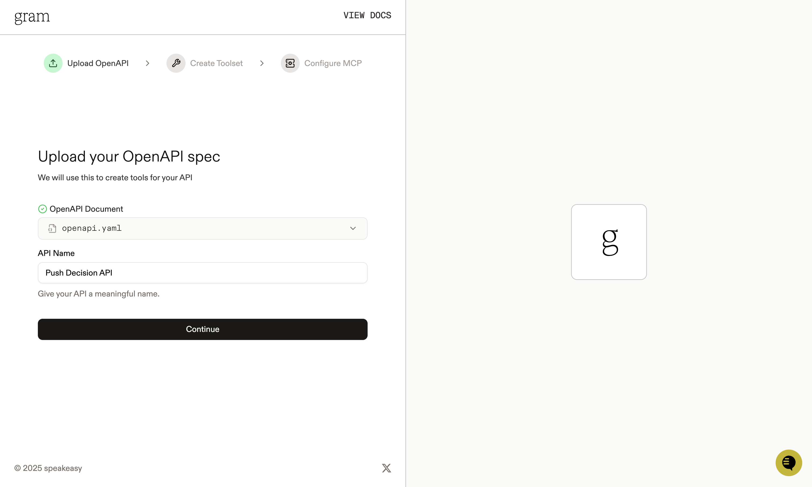


#### Step 2 - Create Toolset

Give your toolset a name (e.g., "Push Advisor") and click **Continue**. You'll also be able to see the names of the tools that will be generated from your OpenAPI document.

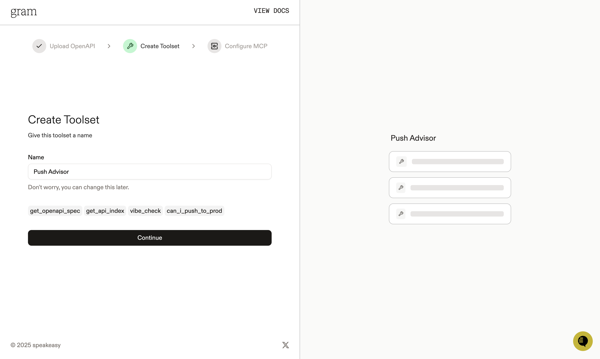

#### Step 3 - Configure MCP

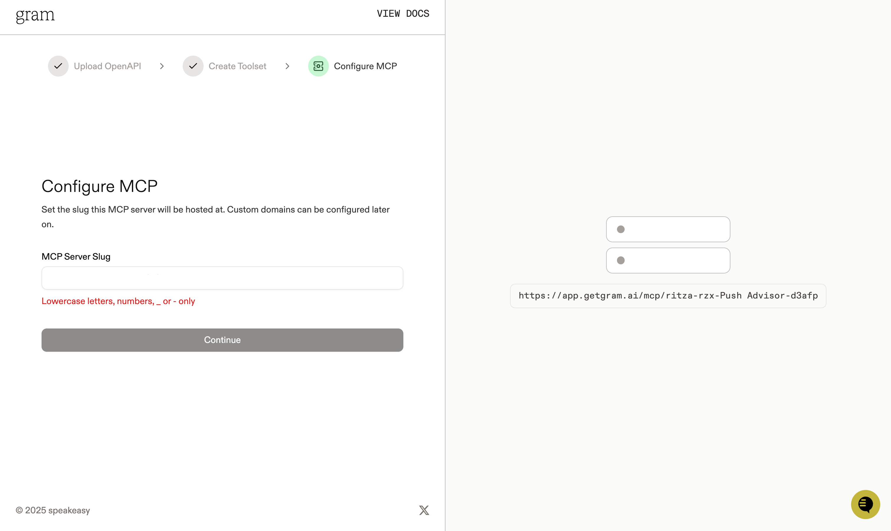

Enter the MCP server slug for the MCP server URL you want your hosted MCP server to be available at. Click **Continue**.

Your Push Advisor Toolset will be created automatically. You can find it in the **Toolsets** tab.

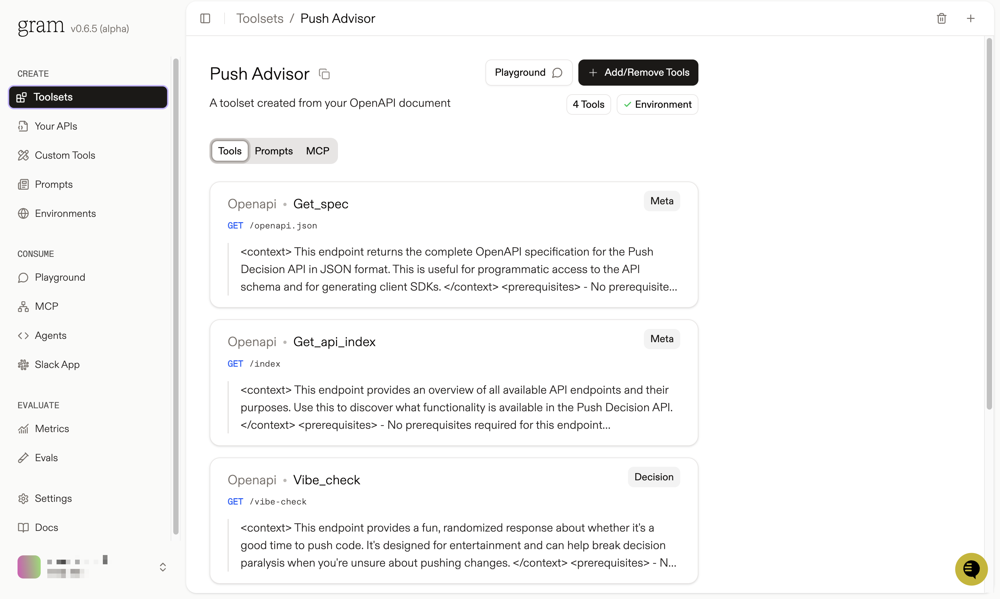

### Configuring environment variables

[Environments](../concepts/environments) store API keys and configuration separate from your toolset logic. 

Go to the **Environments** tab and click the "Default" environment. Click **Fill for toolset** and select your "Push Advisor" toolset to automatically populate the required variables. 

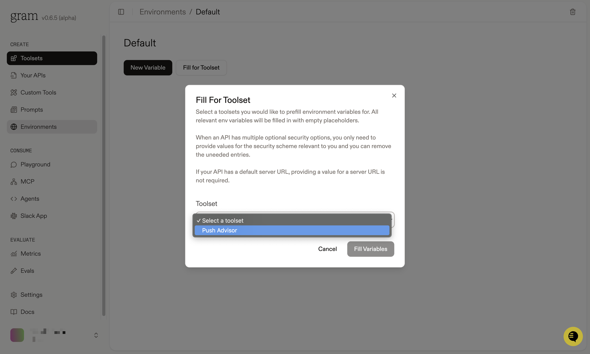

Set the `OPENAPI_SERVER_URL` variable to the URL of your API server. Click **Save**.


### Publishing your MCP server

Finally, lets make the toolset available as an MCP server. 

Go to the **MCP** tab, find the "Push Advisor" toolset, and click **Edit**. On the MCP Details page, tick the **Public** checkbox and click **Save**.

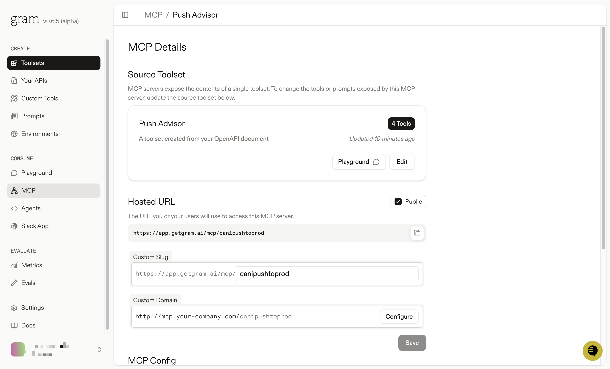

Scroll down to the **MCP Config** section and copy the Public Server configuration.

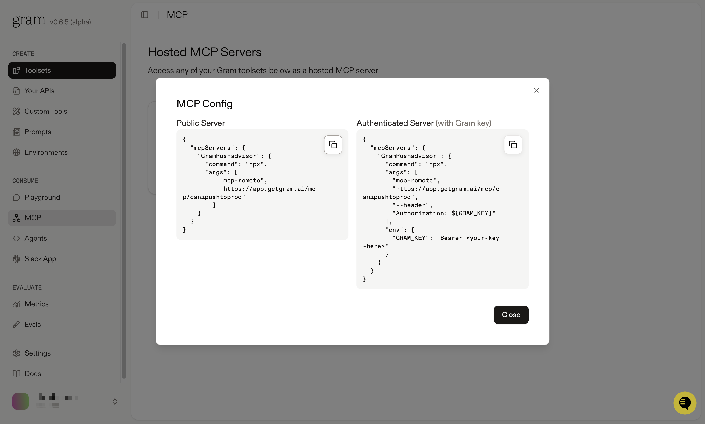

The configuration will look something like this:

```json
{
  "mcpServers": {
    "GramPushadvisor": {
      "command": "npx",
      "args": [
          "mcp-remote",
          "https://app.getgram.ai/mcp/canipushtoprod"
        ]
    }
  }
}
```

:::tip[Tip]
Alternatively, you can use the Authenticated Server configuration. This is useful if you want to use the MCP server in a private environment. You'll need to generate an API key in the **Settings** tab and use it in the MCP Config.
:::

If you're using the Authenticated Server configuration:

```json
{
  "mcpServers": {
    "GramPushadvisor": {
      "command": "npx",
      "args": [
        "mcp-remote",
        "https://app.getgram.ai/mcp/canipushtoprod",
        "--header",
        "Authorization: ${GRAM_KEY}"
      ],
      "env": {
        "GRAM_KEY": "Bearer <your-key-here>"
      }
    }
  }
}
```

## Connect Gemini CLI to your MCP server

Now we'll connect Gemini CLI to your newly created MCP server.

### Add the server to Gemini CLI

Gemini CLI uses a `settings.json` configuration file to manage MCP servers. You can configure servers either globally at `~/.gemini/settings.json` or for a specific project at `.gemini/settings.json` in your project root.

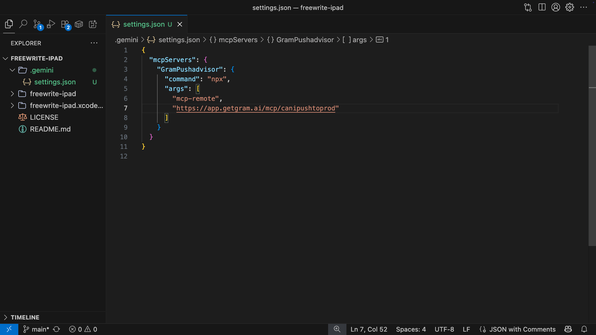

**For the Public Server configuration**, add this to your `settings.json`:

```json
{
  "mcpServers": {
    "GramPushadvisor": {
      "command": "npx",
      "args": [
        "mcp-remote",
        "https://app.getgram.ai/mcp/canipushtoprod"
      ]
    }
  }
}
```

**For the Authenticated Server configuration**, add this to your `settings.json`:

```json
{
  "mcpServers": {
    "GramPushadvisor": {
      "command": "npx",
      "args": [
        "mcp-remote",
        "https://app.getgram.ai/mcp/canipushtoprod",
        "--header",
        "Authorization: ${GRAM_KEY}"
      ],
      "env": {
        "GRAM_KEY": "Bearer your-api-key-here"
      }
    }
  }
}
```

:::tip[Configuration Options]
- `"command"`: The executable to run (in this case `npx`)
- `"args"`: Array of command-line arguments
- `"env"`: Environment variables for the server process (optional)
- `"timeout"`: Request timeout in milliseconds (optional, default: 600,000ms)
- `"trust"`: When `true`, bypasses all tool call confirmations (optional, default: `false`)
:::

### Verify the connection

Start Gemini CLI and check that your server was configured correctly:

```bash
gemini
```

Once in the Gemini CLI session, use the `/mcp` command to view your MCP server status:

```bash
/mcp
```

You should see `GramPushadvisor` in the server list with a list of tools available.

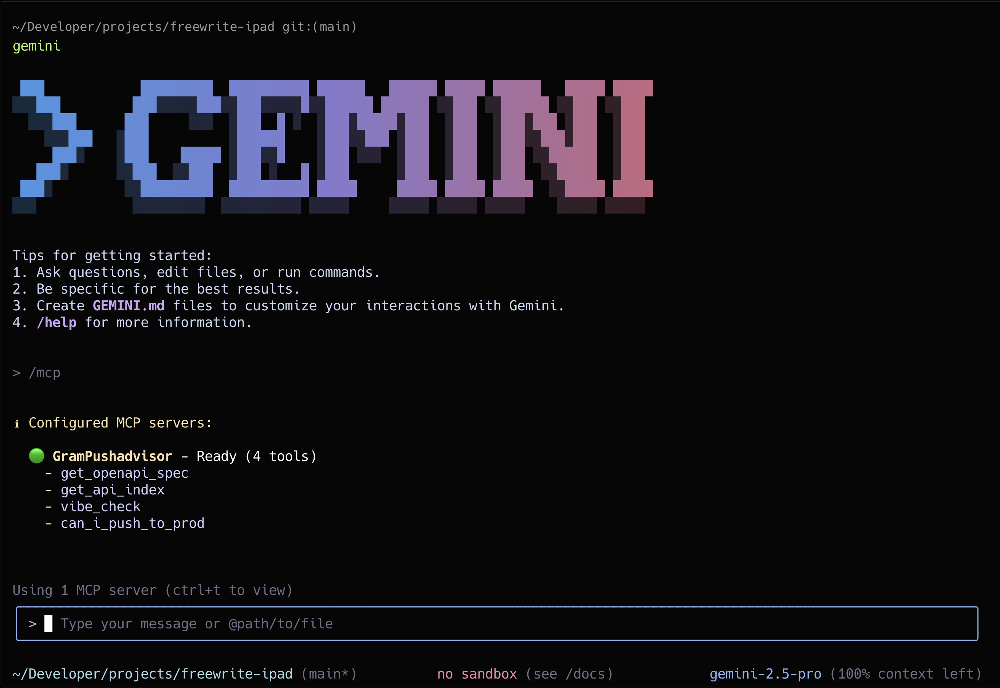

You can also view more details about the servers' tools by using `ctrl + T` to view the tool details.

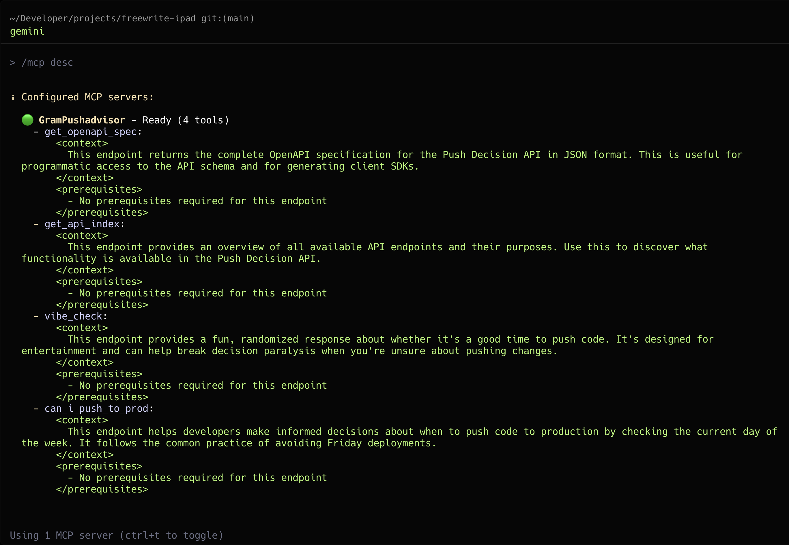

## Test your setup

Now test the connection by running a vibe check.

Ask Gemini a basic question like `whats the vibe today?`

<video width="600" controls>
  <source src="./assets/mcp-gemini/gemini-cli-showcase.mp4" type="video/mp4" />
    Your browser does not support the video tag.
</video>

### Tool permissions

Ask Gemini to check if it's safe to push code to production today:

```
> Is it safe to push code to production today?
```

Gemini CLI will use the `can_i_push_to_prod` tool to check the current day. Before making the API call, it will ask for your permission to use the tool:

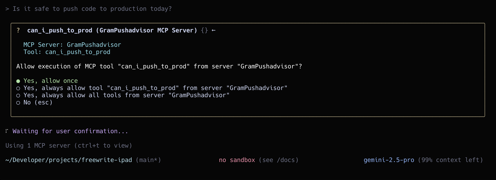

You can choose to approve the tool call once, or always allow this tool to disable future prompts. Once approved, Gemini will make the API call and respond with the vibe check results:

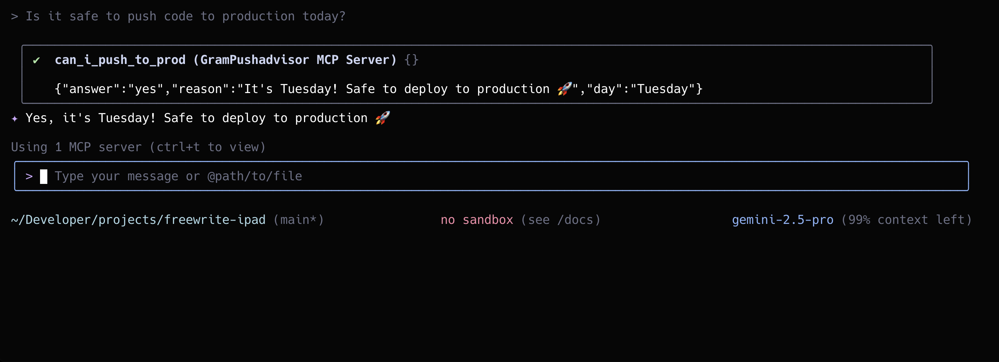

## Troubleshooting 

Let's go through some common issues and how to fix them.

### Server not found

If Gemini CLI can't find your server, click `ctrl + O` to view the MCP Debug console.

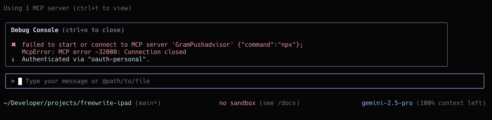

If you see `failed to start or connect to MCP server`, verify that the `settings.json` file is correct and matches the configuration from Gram.

### Authentication errors

If you get authentication errors, verify your Gram API key in the dashboard under **Settings > API Keys**, check that your environment variables are set correctly in Gram, and ensure the Push Advisor API base URL is accessible.

### Tool calls not working

If Gemini CLI isn't calling the tools:

1. Test the MCP server in the **Gram Playground** first
2. Check that the toolset includes the tools you want to use  
3. Verify the environment is correctly configured with required variables
4. Use `/mcp` in Gemini CLI to confirm the server lists the expected tools

## What's next

You now have Gemini CLI connected to a Gram-hosted MCP server with vibe checking capabilities. 

Ready to build your own MCP server? [Try Gram today](https://getgram.ai) and see how easy it is to turn any API into agent-ready tools. 