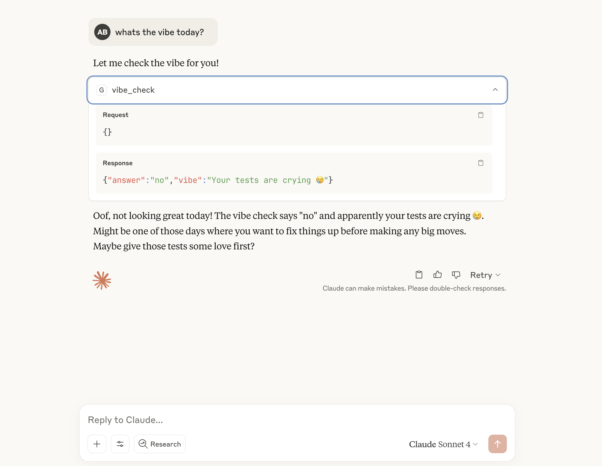
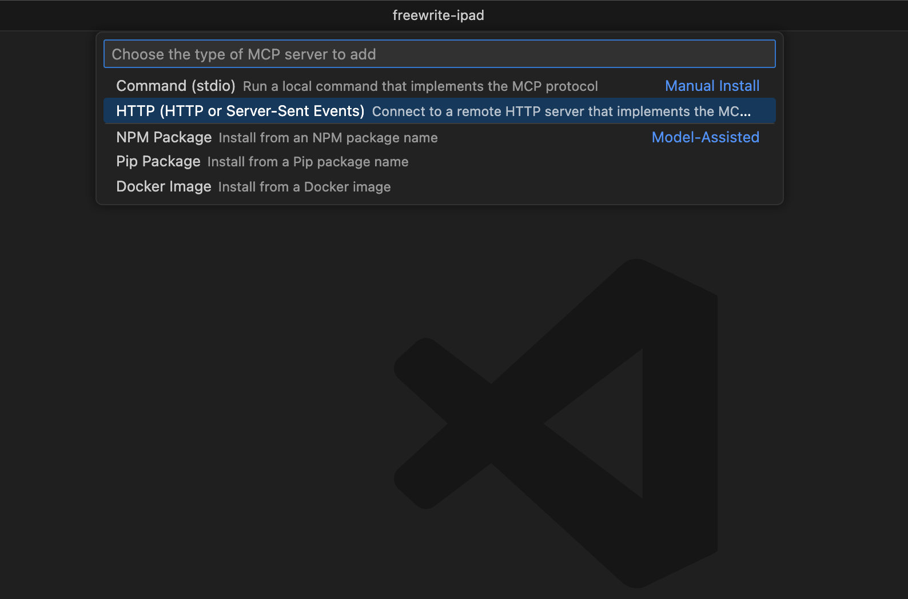
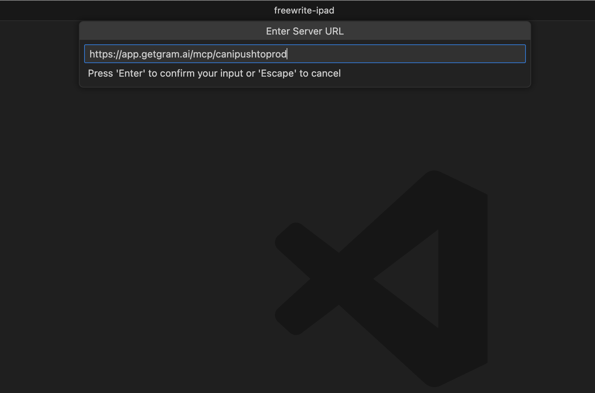
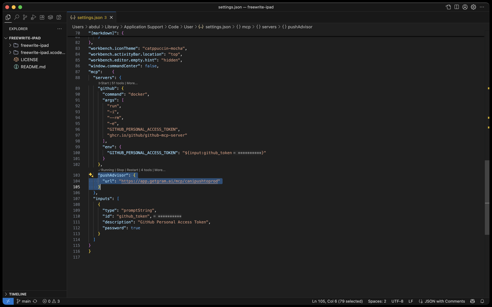
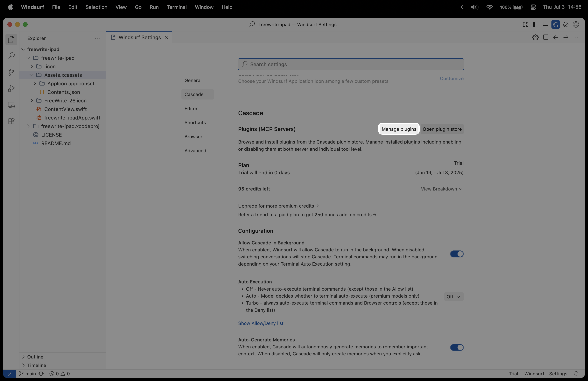
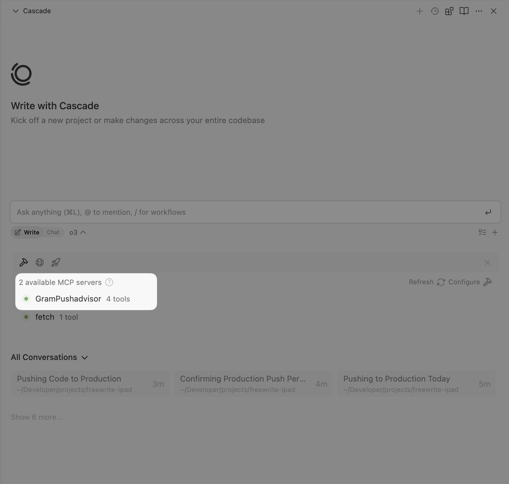
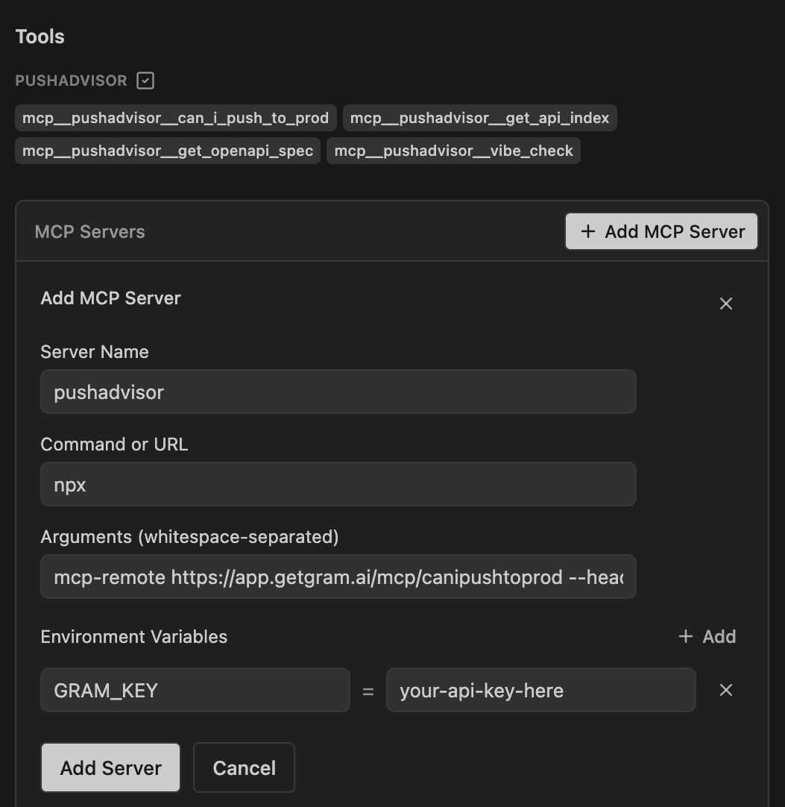
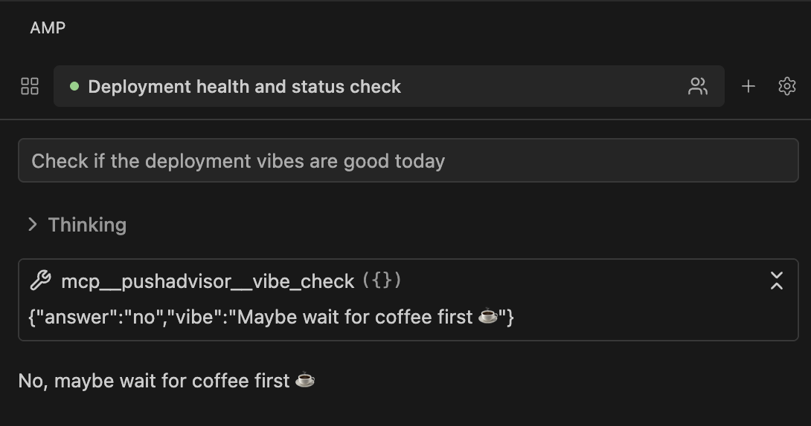
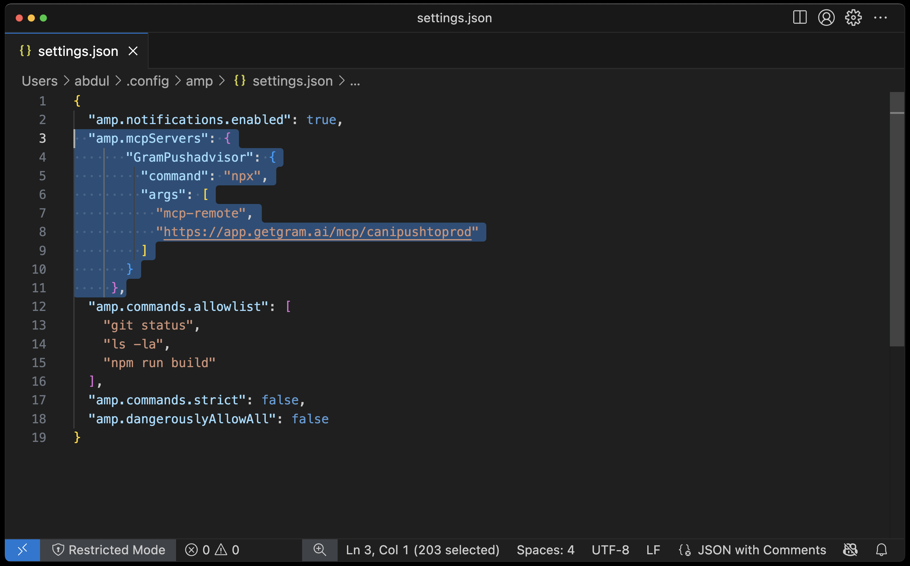
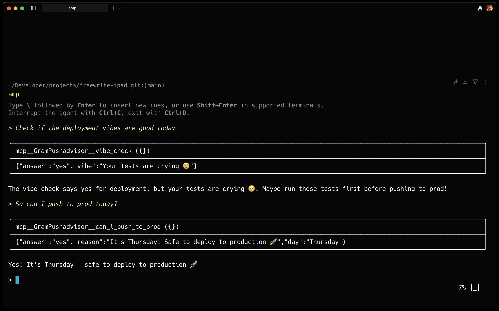

The Model Context Protocol (MCP) connects your AI assistants to real-world tools and data sources. Instead of manually copying and pasting information between tools and your AI assistant, MCP lets your AI assistant interact directly with APIs, databases, and services through standardized tool calls.

While most MCP server setups require complex local configurations, [Gram](https://getgram.ai) simplifies this by hosting MCP servers in the cloud. You can turn any OpenAPI document into a fully functional MCP server in minutes, without managing infrastructure or dealing with authentication complexity.

In this guide, we'll show you how to create a Gram-hosted MCP server and connect it to your IDE AI assistant. You'll learn how to set up the server, configure it, and use it across some of the most popular IDE-based AI assistants.

## What you'll build

We'll create a Gram-hosted MCP server built around the **Push Advisor API**, a simple "vibe check" service that tells you whether it's safe to push code to production based on the day of the week.

This setup enables asking your IDE's AI assistant whether the vibes are good to push code to production, with the assistant automatically calling the appropriate API endpoints through the MCP server.

You can find the full code for the example API as well as the OpenAPI document in the [example repository](https://github.com/ritza-co/gram-examples/tree/main/push-advisor-api).

## Prerequisites

Before starting, you'll need:

- **A Gram account** - Sign up at [getgram.ai](https://getgram.ai)
- **An IDE that supports MCP** - We'll cover Claude Desktop, Cursor, VS Code with Copilot, and other popular options

## Creating a Gram MCP server

First, let's create the MCP server in Gram. If you already have a Gram MCP server configured, you can skip to [Part 2](#part-2-connecting-to-your-ide).

For an in-depth guide on how Gram works and its core concepts, check out the [Gram concepts guide](/blog/gram-concepts).

### Step 1: Creating tools

The Push Advisor API is a simple deployment decision service that tells you whether "the vibes are good" to push code based on the day of the week. It's hosted at `canpushtoprod.abdulbaaridavids04.workers.dev` and includes endpoints like `/vibe-check` for deployment vibes.

A [**tool**](/concepts/tool-definitions) in Gram represents a single callable API action. You can create tools by uploading an OpenAPI document or selecting from pre-built integrations.

1. Log in to the [Gram dashboard](https://getgram.ai)
2. Go to the **Home** tab and click **New OpenAPI Source**
3. Upload the [Push Advisor OpenAPI document](https://github.com/ritza-co/gram-examples/blob/main/push-advisor-api/openapi.yaml)
4. Give it a name and an MCP server slug for the MCP server you'll create later

Your Push Advisor [**Toolset**](/concepts/toolsets) will be created automatically. You can find it in the **Toolsets** tab.


### Step 2: Configuring environment variables

[**Environments**](/concepts/environments) store API keys and configuration separate from your toolset logic. This separation is crucial for managing different deployment contexts, multi-tenant APIs, or team-specific credentials.

1. Go to the **Environments** tab and click the "Default" environment
2. Click **Fill for toolset** and select your "Push Advisor" toolset to automatically populate the required variables
3. Set the `OPENAPI_SERVER_URL` to `https://canpushtoprod.abdulbaaridavids04.workers.dev`
4. Click **Save**


### Step 3: Publishing your MCP server

Now let's make the toolset available as an MCP server that you can connect to from any IDE.

1. Go to the **MCP** tab
2. Find the "Push Advisor" toolset and click **Edit**
3. On the MCP Details page, tick the **Public** checkbox and click **Save**


4. Scroll down to the **MCP Config** section and copy the Public Server configuration


The configuration will look something like this:

```json
{
  "mcpServers": {
    "GramPushadvisor": {
      "command": "npx",
      "args": [
          "mcp-remote",
          "https://app.getgram.ai/mcp/canipushtoprod"
        ]
    }
  }
}
```

:::tip[Tip]
Alternatively, you can use the Authenticated Server configuration. This is useful if you want to use the MCP server in a private environment. You'll need to generate an API key in the **Settings** tab and use it in the MCP Config.
:::

Your Gram MCP server is now ready! In the next part, we'll connect it to your IDE.

## Installing MCP Servers in your IDE

Now that you have a Gram-hosted MCP server, let's connect it to your IDE's AI assistant. Most IDEs support MCP through configuration files that specify which servers to connect to and how to authenticate with them.

The configuration you copied from Gram in Step 3 will work across all MCP-compatible clients. We'll show you how to add it to the most popular IDE-based AI assistants.

### How to install MCP Servers in Claude Desktop

Claude Desktop is Anthropic's standalone AI assistant application that supports MCP through a JSON configuration file.

#### Installing the Gram MCP Server in Claude Desktop

<div class="flex justify-center">
  <video controls>
    <source src="./assets/installing-gram-mcp-in-ide/installing-mcp-claude-desktop.mp4" type="video/mp4"></source>
    Your browser does not support the video tag.
  </video>
</div>

1. **Access the Claude settings**

   Open Claude Desktop and access the settings. On macOS, click **Claude -> Settings...** from the menu bar. On Windows, access the settings through the application menu.

2. **Open the MCP configuration**

   Navigate to the **Developer** section in the left sidebar of the **Settings** window. Click **Edit Config** to open the MCP configuration file. This will create or open the configuration file at:

   - **macOS**: `~/Library/Application Support/Claude/claude_desktop_config.json`
   - **Windows**: `%APPDATA%\Claude\claude_desktop_config.json`

3. **Add your Gram server configuration**

   Replace the file content with your Gram MCP configuration. For the **Public Server**, use:

   ```json
   {
     "mcpServers": {
       "GramPushadvisor": {
         "command": "npx",
         "args": [
           "mcp-remote",
           "https://app.getgram.ai/mcp/canipushtoprod"
         ]
       }
     }
   }
   ```

   For the **Authenticated Server**, use:

   ```json
   {
     "mcpServers": {
       "GramPushadvisor": {
         "command": "npx",
         "args": [
           "mcp-remote",
           "https://app.getgram.ai/mcp/canipushtoprod",
           "--header",
           "Authorization: ${GRAM_KEY}"
         ],
         "env": {
           "GRAM_KEY": "Bearer your-api-key-here"
         }
       }
     }
   }
   ```

4. **Test the connection**

   Save the configuration file, close Claude Desktop completely, and reopen it. Once restarted, click **🔨** (the hammer icon) to see the available tools. Test the connection by asking:

   > What's the vibe today?

   Claude will use your Gram MCP server to check the vibes through the Push Advisor API.

   

### How to install MCP Servers in Cursor

Cursor integrates MCP servers through its built-in configuration interface, making it easy to add and manage servers directly from the settings.

#### Installing the Gram MCP Server in Cursor

<div class="flex justify-center">
  <video controls>
    <source src="./assets/installing-gram-mcp-in-ide/installing-mcp-cursor.mp4" type="video/mp4"></source>
    Your browser does not support the video tag.
  </video>
</div>

1. **Access the MCP configuration**

   Open Cursor and navigate to **Settings -> Cursor Settings**, then open the **Tools & Integrations** tab. Look for the MCP section and click **Add Custom MCP** to access the configuration interface.

2. **Add your Gram server**

   This opens Cursor's global MCP configuration file. Add your Gram MCP Server configuration:

   ```json
   {
     "mcpServers": {
       "GramPushadvisor": {
         "command": "npx",
         "args": [
           "mcp-remote",
           "https://app.getgram.ai/mcp/canipushtoprod"
         ]
       }
     }
   }
   ```

   For authenticated servers, include the environment variables:

   ```json
   {
     "mcpServers": {
       "GramPushadvisor": {
         "command": "npx",
         "args": [
           "mcp-remote",
           "https://app.getgram.ai/mcp/canipushtoprod",
           "--header",
           "Authorization: ${GRAM_KEY}"
         ],
         "env": {
           "GRAM_KEY": "Bearer your-api-key-here"
         }
       }
     }
   }
   ```

3. **Use the Gram tools**

   Once configured, access the Gram MCP functionality through Cursor's AI chat by clicking the chat icon or using `Cmd/Ctrl + L`. You can now ask questions like:

   > What's the vibe for pushing code today?

### How to install MCP Servers in VS Code with GitHub Copilot

VS Code supports MCP through GitHub Copilot with version 1.101 or later.

#### Installing the Gram MCP Server in VS Code


1. **Add the MCP server to your settings.json file**

   Open your VS Code command palette with `Ctrl/Cmd + Shift + P` and search for `Add MCP Server`. Select the **HTTP** option.

   

   Paste in the URL of your hosted MCP server nd enter a server ID, which will be used to identify the server in the MCP configuration.

   

   Your MCP server will now show up in the list of MCP servers withing your settings.json file.

   

2. **(Optional) Add an API key to your settings.json file**

   If you're using an **authenticated server**, you can add an API key to your settings.json file.

   For authenticated servers:

   ```json
   ...
   {
     "servers": {
       "GramPushadvisor": {
         "command": "npx",
         "args": [
           "mcp-remote",
           "https://app.getgram.ai/mcp/canipushtoprod",
           "--header",
           "Authorization: ${input:gram_token}"
         ]
       }
     },
     "inputs": [
       {
         "type": "promptString",
         "id": "gram_token",
         "description": "Gram API Token",
         "password": true
       }
     ]
   }
   ...
   ```

3. **Start the server**

   Open the Command Palette (`Ctrl/Cmd + Shift + P`) and type `MCP: List Servers` to see available servers. Click on the Gram MCP Server to start it.

4. **Use with Copilot**

   Once configured, the Gram MCP tools become available in the Copilot chat interface. You can enable and disable specific tools as needed and ask questions like:

   > Should I push this code to production?

    
<div class="flex justify-center">
  <video controls>
    <source src="./assets/installing-gram-mcp-in-ide/vscode-prod-check.mp4" type="video/mp4"></source>
    Your browser does not support the video tag.
  </video>
</div>

### How to install MCP Servers in Windsurf

Windsurf provides a straightforward interface for managing MCP servers through its plugin system.

#### Installing the Gram MCP Server in Windsurf

1. **Access Windsurf settings**

   Click **Windsurf** in the top menu bar, then navigate to **Settings -> Windsurf Settings** to open the main configuration interface.

2. **Open plugin management**

   Under the **Plugins (MCP Servers)** section, click **Manage plugins** to access the plugin configuration area. Click **View raw config** to open the configuration file editor.

   

3. **Configure the Gram server**

   A new file named `mcp_config.json` will open. Replace the contents with your Gram configuration:

   ```json
   {
     "mcpServers": {
       "GramPushadvisor": {
         "command": "npx",
         "args": [
           "mcp-remote",
           "https://app.getgram.ai/mcp/canipushtoprod"
         ]
       }
     }
   }
   ```

4. **Activate the plugin**

   Save the `mcp_config.json` file, return to the **Manage plugins** tab, and click **Refresh** to reload the plugin configuration. The Gram plugin will now appear in your available plugins and is ready to use.

   

### How to install MCP Servers in Amp

[Amp](https://ampcode.com/manual#mcp) is an agentic coding tool built by Sourcegraph that runs in VS Code and compatible editors, as well as a command-line tool. It supports MCP through configuration settings.

#### Installing the Gram MCP Server in Amp

The Amp VSCode extension has a GUI for installing and managing MCP servers.

<div class="flex justify-center">
  <video controls>
    <source src="./assets/installing-gram-mcp-in-ide/amp-installing-mcp.mp4" type="video/mp4"></source>
    Your browser does not support the video tag.
  </video>
</div>

1. **Open the Amp settings**

   Open the Amp settings by clicking the settings icon in the side window. Scroll down to the **MCP Servers** section and click **Add MCP Server**.

2. **Add your Gram server configuration**

   Type in the name of your MCP server, and under *Command or URL*, type in `npx`. Under *Arguments*, type in `mcp-remote https://app.getgram.ai/mcp/canipushtoprod`. If you're using an authenticated server, type in `mcp-remote https://app.getgram.ai/mcp/canipushtoprod --header "Authorization: ${GRAM_KEY}"` and under *Environment Variables*, type in `GRAM_KEY=your-api-key-here`.

   

3. **Use the Gram tools**

   Once configured, Amp will automatically load your Gram MCP server. You can now interact with the Push Advisor API through natural language prompts like:

   > Check if the deployment vibes are good today

   


#### Installing the Gram MCP Server in Amp CLI

The Amp CLI can be configured through the `settings.json` file.

1. **Access the configuration file**

   Amp can be configured through the CLI configuration file. The CLI configuration file location varies by operating system:

   - **Windows**: `%APPDATA%\amp\settings.json`
   - **macOS**: `~/.config/amp/settings.json`  
   - **Linux**: `~/.config/amp/settings.json`

2. **Add your Gram server configuration**

   

   Add the `amp.mcpServers` setting with your Gram MCP server configuration:

   ```json
   {
     "amp.mcpServers": {
       "GramPushadvisor": {
         "command": "npx",
         "args": [
           "mcp-remote",
           "https://app.getgram.ai/mcp/canipushtoprod"
         ]
       }
     }
   }
   ```

   For authenticated servers, include the environment variables:

   ```json
   {
     "amp.mcpServers": {
       "GramPushadvisor": {
         "command": "npx",
         "args": [
           "mcp-remote",
           "https://app.getgram.ai/mcp/canipushtoprod",
           "--header",
           "Authorization: ${GRAM_KEY}"
         ],
         "env": {
           "GRAM_KEY": "Bearer your-api-key-here"
         }
       }
     }
   }
   ```

3. **Use the Gram tools**

   Once configured, Amp will automatically load your Gram MCP server. You can now interact with the Push Advisor API through natural language prompts like:

   > Check if the deployment vibes are good today

   

   :::tip[Note]
   Amp recommends being selective with MCP tools for best performance. Too many available tools can reduce model performance, so consider disabling unused MCP tools by adding them to the `amp.tools.disable` setting.
   :::

## Troubleshooting

Here are some common issues and solutions:

### Server not connecting

If your IDE can't connect to the Gram server:

- Verify the MCP server URL is correct in your configuration
- Check that the API behind the MCP server is reachable from your machine
- Ensure the `npx` command is available (reinstall Node.js if needed)
- Try restarting your IDE after making configuration changes

### Authentication errors

If you're using an authenticated server and getting authentication errors:

- Verify your Gram API key in the dashboard under **Settings > API Keys**
- Ensure the API key is correctly formatted with the `Bearer ` prefix

### Tools not appearing

If the tools aren't showing up in your IDE:

- Test the MCP server in the **Gram Playground** first to ensure it's working
- Check that the toolset includes the tools you expect to use
- Verify the environment is correctly configured with required variables
- Look for any error messages in your IDE's developer console or logs

## What's next

Ready to build your own MCP server? [Try Gram today](https://getgram.ai) and see how easy it is to turn any API into agent-ready tools that work across all your development environments.


